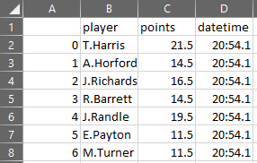

# Mozzart Web Scraper      

 A web scraping script used for picking up NBA player's limits and odds from a [Mozzart](https://www.mozzartbet.com/sr#/) betting company's website using selenium.
 
 ## How it works
 
 Python script used for scraping betting company's website and finalizing output into table on MsSQL server or, for the sake of the presentation, CSV file.
 
 **Important:** As website uses a cookie consent notice, selenium is using webdriver to click on the OK button and then access the page and the Player's data. Make sure you're using the right updated version of a chromedriver that is compatible with your browser.
 Script is packing all info into several columns:
 - Player
 - Team
 - Game date
 - Points (Limit given by the betting company)
 - Date & time indicator of the scraper writing into table
 
 <p align="center">
  
</p>
 
 ## Python modules used  
 - selenium
 - pprint
 - pandas
 - requests
 - bs4
 - datetime
 - sqlalchemy


## What's included

Within the download you'll find common assets providing both compiled and minified variations. You should see something like this:

```text
meridian-web-scraper/
├── chromedriver.exe
├── mozzart-output.csv
├── mozzart-scraper.py
└── mozzart-output.png
```
